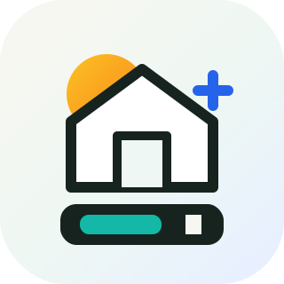
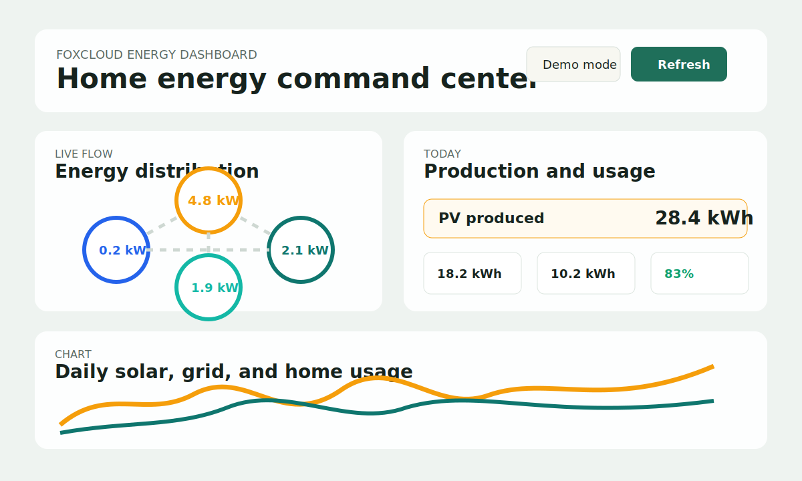

# FoxCloud Energy Dashboard



A beginner-friendly, open-source web dashboard for Fox ESS / FoxCloud battery systems.

This project is designed so other FoxCloud users can clone it, add their own credentials through environment variables, and run their own private dashboard safely without exposing secrets in the browser.

New users should start with [README_FIRST.md](README_FIRST.md).

Recent project changes are tracked in [CHANGELOG.md](CHANGELOG.md).



## Why this stack

This starter uses:

- Node.js
- Express
- TypeScript
- Plain HTML/CSS/JavaScript for the frontend
- Chart.js for charts
- SQLite for local daily energy/history caching
- Local JSON fallback caching for the latest dashboard snapshot
- Demo mode with sample data for users who do not have an API key yet
- Optional local Modbus TCP mode for supported inverters on the same LAN

This is a good beginner-friendly balance because:

- there is only one server process to run
- your FoxCloud API key stays on the server, or you can avoid FoxCloud entirely with Modbus mode
- the frontend stays simple and easy to edit
- long range views can use local SQLite data instead of repeatedly calling FoxCloud
- the project is easy to deploy to common Node hosting providers

## Security model

Your secrets are never put into frontend code.

- The browser only calls your local backend at `/api/dashboard`.
- The backend signs requests to FoxCloud using `FOXCLOUD_API_KEY`.
- In Modbus mode, the backend reads your inverter/datalogger on the local network and no FoxCloud API key is required.
- `.env` is ignored by Git so secrets are not committed.
- The sample `.env.example` contains placeholders only.

## Project structure

```text
.
├── public/                 # Frontend dashboard assets
├── docs/                   # README images and documentation assets
├── .github/                # GitHub issue templates
├── src/
│   ├── config/             # Environment variable parsing
│   ├── lib/                # FoxCloud API client
│   ├── services/           # Dashboard aggregation, SQLite storage, and local cache storage
│   └── types/              # Shared TypeScript types
├── data/                   # Local SQLite/cache/history files (gitignored except .gitkeep)
├── scripts/                # Local setup helper scripts
├── .env.example
├── .gitignore
├── CONTRIBUTING.md
├── LICENSE
├── README_FIRST.md
├── package.json
├── README.md
└── tsconfig.json
```

## What the dashboard shows

- Solar generated
- Grid export and import
- Home usage
- Battery charge and discharge
- Grid consumption
- `daily_feedin` shown as `Return to grid`
- `generation` shown as `Solar production`
- `daily_charged_energy_total` shown as `Energy going into the battery`
- `daily_discharged_energy_total` shown as `Energy coming out of the battery`

The backend maps FoxCloud report values into friendly labels for the UI.

## Local SQLite cache

The app automatically creates a local SQLite database at:

```text
data/foxcloud-dashboard.sqlite
```

This database stores normalized daily energy rows for your own installation. It is intentionally ignored by Git because it may contain private household energy data.

The cache helps reduce FoxCloud API calls:

- monthly and long-range table views read from SQLite first
- missing months are fetched from FoxCloud and then saved locally
- the current month is refreshed periodically so today's values stay useful
- range views such as 3 months, 6 months, 1 year, and all data avoid re-fetching data that is already cached

The dashboard also includes a manual `Rebuild cache` button. It recalculates the selected range from FoxCloud 5-minute history samples so daily rows better match the FoxCloud Analysis day view. Use it only when you want to refresh historical values because it can call the FoxCloud API many times.

For open-source use, each person who clones the project gets their own local database after running the app.

## SQLite backups

The server can automatically back up SQLite while it is running. In Docker, `/app/backups` is mapped to the host folder:

```text
./backups
```

For your NAS project folder, that means backups appear under:

```text
/Volumes/Newhome/docker/foxcloud-dashboard/backups
```

Useful backup settings:

```dotenv
SQLITE_BACKUP_ENABLED=true
SQLITE_BACKUP_DIR=/app/backups
SQLITE_BACKUP_INTERVAL_MS=3600000
SQLITE_BACKUP_RETENTION_COUNT=72
```

The backup uses SQLite's backup API, not a raw file copy, so it is safer while the app is running. Keep the `backups` folder private because it contains household energy history.

## Environment variables

Copy the example file first:

```bash
cp .env.example .env
```

Then edit `.env` and add your own values:

```dotenv
PORT=3000
HOST=0.0.0.0
DASHBOARD_TIME_ZONE=Australia/Sydney
DATA_PROVIDER=foxcloud
FOXCLOUD_BASE_URL=https://www.foxesscloud.com
FOXCLOUD_DEMO_MODE=false
FOXCLOUD_API_KEY=your-real-api-key-here
FOXCLOUD_USERNAME=your-foxcloud-username-if-needed
FOXCLOUD_PASSWORD=your-foxcloud-password-if-needed
FOXCLOUD_DEVICE_SN=optional-device-serial-number
FOXCLOUD_TIMEOUT_MS=15000
DASHBOARD_USERNAME=choose-a-dashboard-login-name
DASHBOARD_PASSWORD=choose-a-strong-dashboard-password
DASHBOARD_USERS=Foxtester=choose-a-strong-test-password
```

Notes:

- `DATA_PROVIDER=foxcloud` uses FoxCloud OpenAPI.
- `DATA_PROVIDER=modbus` uses local Modbus TCP and does not require a FoxCloud API key.
- `FOXCLOUD_API_KEY` is required only for FoxCloud mode.
- `FOXCLOUD_DEMO_MODE=true` lets users preview the dashboard with sample data and no API key.
- `HOST=0.0.0.0` allows other devices on the same home network to open the dashboard.
- `FOXCLOUD_BASE_URL` defaults to `https://www.foxesscloud.com`.
- `FOXCLOUD_DEVICE_SN` is optional but helpful if your account has multiple devices.
- `FOXCLOUD_USERNAME` and `FOXCLOUD_PASSWORD` are kept server-side only. The current starter uses the official API key flow, but those variables are included so the repo is ready for future auth extensions without putting credentials in the browser.
- `DASHBOARD_USERNAME` and `DASHBOARD_PASSWORD` enable basic dashboard login protection for your main account. Set both before exposing the app outside your home network.
- `DASHBOARD_USERS` is optional and adds extra dashboard-only users. Use comma-separated entries such as `Foxtester=strong-password,Friend2=another-strong-password`.

For local Modbus mode:

```dotenv
DATA_PROVIDER=modbus
MODBUS_HOST=replace-with-your-inverter-lan-ip
MODBUS_PORT=502
MODBUS_UNIT_ID=1
MODBUS_TIMEOUT_MS=3000
MODBUS_SAMPLE_INTERVAL_MS=60000
MODBUS_DEVICE_ID=local-modbus-inverter
MODBUS_STATION_NAME=Local Modbus inverter
MODBUS_INVERTER_MODEL=FoxESS H3 Smart
MODBUS_READ_ONLY=true
```

Notes for Modbus mode:

- The dashboard server must be on the same LAN/Wi-Fi as the inverter or datalogger.
- The app currently implements a read-only FoxESS H3 Smart register map, based on local testing plus community register references.
- It stores sampled live values and daily totals in SQLite. Historical rows begin from the time you start using Modbus mode unless you import or rebuild history separately.
- `MODBUS_SAMPLE_INTERVAL_MS=60000` runs a background sampler every minute so the last-24-hours chart keeps filling even when nobody has the browser open.
- Keep `MODBUS_READ_ONLY=true`. Writing inverter settings is intentionally not enabled in this dashboard yet.
- You can quickly test connectivity with `nc -zv YOUR_INVERTER_IP 502`.

## Local setup

1. Install Node.js 20 or newer.
2. Clone the repository.
3. Copy `.env.example` to `.env`.
4. Add your own FoxCloud API key in `.env`, or set `DATA_PROVIDER=modbus` and add your inverter LAN IP.
5. Or run `npm run setup` to create `.env` with a guided prompt.
5. Run:

```bash
npm install
npm run dev
```

6. Open [http://localhost:3000](http://localhost:3000)

When using `npm run dev`, restart the command after editing `.env`; `tsx watch` does
not reload environment variable changes automatically.

## Production build

```bash
npm install
npm run build
npm start
```

## Docker

This project includes a `Dockerfile` and `docker-compose.example.yml`.

For local Docker testing:

```bash
cp docker-compose.example.yml docker-compose.yml
cp .env.example .env
npm install
docker compose up --build -d
```

The container stores SQLite data in the mounted `./data` folder. Keep that folder private and do not commit it.

## Synology NAS Deployment

For a Synology NAS such as DiskStation DS923+, the recommended deployment path is Docker / Container Manager.

High-level steps:

1. Install `Container Manager` from Synology Package Center.
2. Copy this project folder to a NAS shared folder, for example a `docker/foxcloud-dashboard` folder in your NAS file share.
3. Copy `.env.example` to `.env` on the NAS and fill in your own environment variables there.
4. Set `DASHBOARD_USERNAME` and `DASHBOARD_PASSWORD` before exposing the dashboard to the Internet. Add test users with `DASHBOARD_USERS` if needed.
5. For Synology, use `docker-compose.synology.yml`, or copy it to `docker-compose.yml` before creating the Container Manager project.
6. In Container Manager, create a project from the folder, or run `docker compose -f docker-compose.synology.yml up --build -d` if you use SSH.
7. On your home network, open `http://NAS-IP:3000`, or use the port from `DASHBOARD_HOST_PORT` if you changed it.

If the container keeps restarting and the log shows `SQLITE_CANTOPEN` or `unable to open database file`, the container cannot write to the SQLite database. Use `docker-compose.synology.yml`; it stores SQLite in a Docker-managed volume instead of the shared folder, which avoids Synology shared-folder permission issues. If Container Manager already created a container from the old compose file, delete and recreate the project so it reads the new compose file.

Do not expose port `3000` directly to the Internet. Use Synology reverse proxy with HTTPS instead.

Safer Internet access options:

- Best security: use Tailscale, WireGuard, or Synology VPN Server and keep the dashboard private.
- If friends need browser access: create a Synology DDNS hostname, add a Let's Encrypt certificate, and use Synology reverse proxy from `https://your-name.synology.me` to `http://127.0.0.1:3000`.
- Keep dashboard authentication enabled with `DASHBOARD_USERNAME` and `DASHBOARD_PASSWORD`, and use `DASHBOARD_USERS` for extra dashboard-only logins.

Avoid exposing DSM management ports `5000` or `5001` publicly unless you really know what you are doing.

## How it works

The dashboard uses a backend proxy because your FoxCloud credentials must stay on the server.

The main flow is:

1. Browser requests `/api/dashboard`
2. Express backend reads secrets from environment variables
3. Backend calls FoxCloud API with signed headers, or reads local Modbus TCP registers if `DATA_PROVIDER=modbus`
4. Backend returns only safe dashboard data to the browser
5. Frontend renders cards, charts, and tables

For live/today values in FoxCloud mode, the dashboard can use FoxCloud 5-minute history samples so `PV produced` follows the FoxCloud Analysis day-view formula: self-consumption plus export. For historical rows, use `Rebuild cache` to recalculate the selected range with the same history-based approach.

In Modbus mode, the dashboard reads live holding registers directly from the inverter/datalogger. This is faster and avoids API request limits, but register layouts vary by inverter model and firmware, so more models will need community testing before they are marked as supported.

## FoxCloud API endpoints used

This starter follows the official Fox ESS Open API documentation and uses:

- `POST /op/v0/device/list`
- `POST /op/v0/device/real/query`
- `POST /op/v0/device/report/query`
- `POST /op/v0/device/history/query`
- `GET /op/v0/plant/detail`

Official references:

- [Fox ESS Open API documentation](https://www.foxesscloud.com/public/i18n/en/OpenApiDocument.html)
- [Fox ESS FAQ linking to the API docs](https://us.fox-ess.com/us-faq/)

## Modbus references

The first Modbus implementation is read-only and uses community register mappings as a starting point:

- [nathanmarlor/foxess_modbus](https://github.com/nathanmarlor/foxess_modbus)
- [H3 Modbus register wiki](https://github-wiki-see.page/m/rsaemann/HA-FoxESS-H3-Modbus/wiki/H3-Modbus-Registers)

Always verify values against your inverter/app before trusting financial or billing calculations.

## Error handling

The backend handles:

- invalid or missing environment variables
- invalid `year`, `month`, and `range` request parameters
- network timeouts
- FoxCloud API errors
- Modbus connection timeouts or missing `MODBUS_HOST`
- non-JSON responses
- empty device lists

If the live FoxCloud request fails and a previous successful response exists, the app serves cached data from `data/cache/dashboard-latest.json` and shows a warning in the UI.

## Historical data strategy

This starter keeps things simple:

- normalized daily energy rows are stored in `data/foxcloud-dashboard.sqlite`
- every successful dashboard response is also saved to `data/cache/dashboard-latest.json`
- a month-specific JSON snapshot is saved into `data/history/`

This gives you a beginner-friendly local history layer while avoiding excessive FoxCloud API calls.

If the project grows later, good upgrade paths are:

- Postgres for shared or hosted dashboards
- scheduled background sync jobs for long-term analytics

## Why a backend proxy is necessary

You should not call FoxCloud directly from frontend JavaScript because:

- the API key would be visible in the browser
- signed request logic would be exposed
- anyone inspecting network traffic could reuse your credentials

Keeping FoxCloud requests on the server is the safe default.

## Ideas for future improvements

- add login for multiple household viewers
- support multiple inverters or plants
- add weekly and yearly views
- add scheduled refresh jobs to pre-fill SQLite while keeping API calls low
- add support for other FoxCloud data points and device types

## Making this useful for other FoxCloud users

If you want this repo to be broadly useful as an open-source project, keep these habits:

- never hardcode site-specific credentials or serial numbers
- keep environment variable names generic and documented
- make device selection configurable with `FOXCLOUD_DEVICE_SN`
- write friendly README steps for first-time users
- return normalized labels in the backend so other FoxCloud users do not need to learn raw API field names first

## Deployment options

This app is suitable for:

- Render
- Railway
- Fly.io
- a small VPS
- a home server or Raspberry Pi

For deployment:

1. set the same environment variables in your hosting provider
2. run `npm install`
3. run `npm run build`
4. start with `npm start`

## First steps if this is your first Codex project

If you are learning step by step, use this sequence:

1. Start the app locally with your own `.env`
2. Confirm the dashboard loads
3. Check the monthly table values
4. Compare one or two days against the FoxCloud app
5. Commit the project to GitHub
6. Deploy it once you trust the numbers

## Important reminder

Do not commit your `.env` file, and do not paste real API keys or passwords into source files, GitHub issues, or frontend code.
